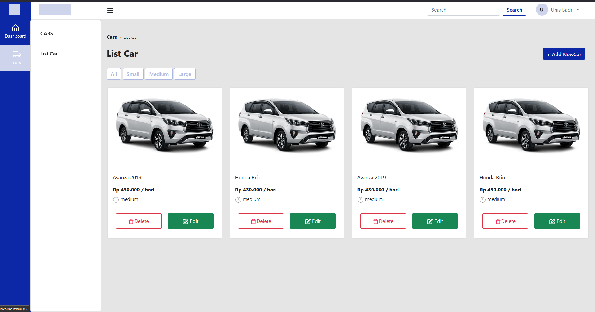
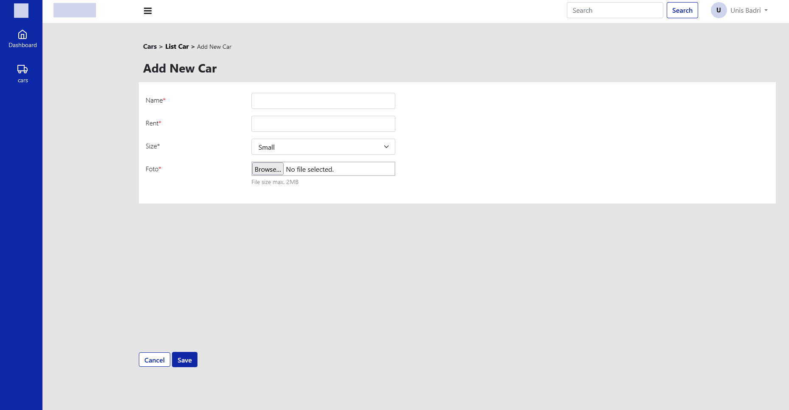
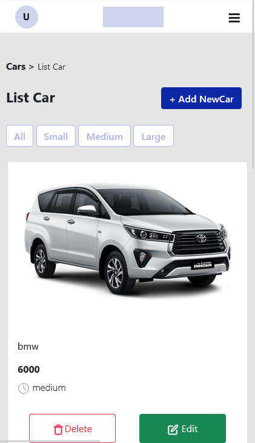
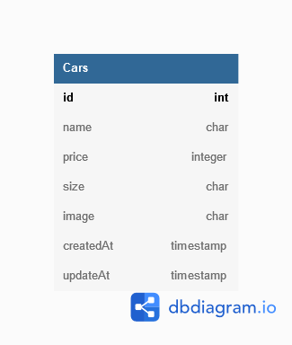
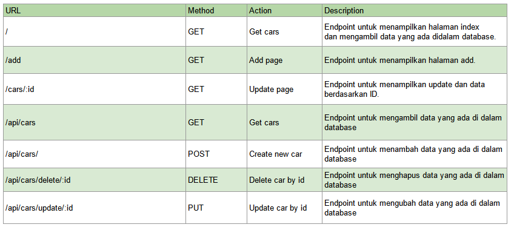

# Challenge FSW Chapter 5 
## Tentang desain web ini

Desain web ini untuk memenuhi kebutuhan manajemen data mobil. Web ini dapat menambah, merubah dan menghapus (CURD) data mobil yang akan disimpan di dalam db potsgres. Dibuat dengan menggunakan:

- [Bootstrap v5.0](https://getbootstrap.com/).
- [Express.js 4.17.3](http://expressjs.com/).
- [Template engine ejs](https://github.com/mde/ejs).
- [Sequelize v6](https://sequelize.org/docs/v6/getting-started/).
- [Axios](https://axios-http.com/docs/intro)

Yang harus diinstall:
- npm install
- npm install --save-dev sequelize-cli
  
Sebelum melakukan migration dimohon untuk mengubah/mengechek inisialisasi data di config/config.js 

Migration:
- npx sequelize-cli db:create 
- npx sequelize-cli db:migrate

Dijalankan dengan command:
- nodemon index.js
## Info

Desain menggunakan template dasar dari [SafnaPrasetiono](https://github.com/SafnaPrasetiono/Dashboard-Part1) dan dirubah mengikuti design [Binar Academy](https://www.figma.com/file/H6xTtBW9Kzlf09nYnitvbH/BCR---Car-Management-Dashboard?node-id=18343%3A5831). 